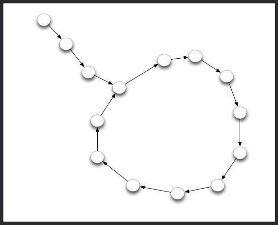

# [Can you get the loop ?](https://www.codewars.com/kata/can-you-get-the-loop/train/python)

You are given a node that is the beginning of a linked list. This list always contains a tail and a loop.

Your objective is to determine the length of the loop.



For example in the following picture the tail's size is 3 and the loop size is 11.

\# Use the `next' attribute to get the following node

node.next

## My Solutions

### Python

```python
def loop_size(node):
    nodes = []
    tail_node = None

    while(not node in nodes):
        nodes.append(node)
        node = node.next

    return len(nodes) - nodes.index(node)
```

### JavaScript

```javascript
function loop_size(node) {
    let rabbit = node.next.next;
    let tottle = node.next;

    while(rabbit != tottle) {
        rabbit = rabbit.next.next;
        tottle = tottle.next;
    }

    let count = 1;
    rabbit = rabbit.next;
    while(tottle != rabbit) {
        count++;
        rabbit = rabbit.next;
    }
    return count;
}
```

## Other Solutions

### Python

```python
def loop_size(node):
    turtle, rabbit = node.next, node.next.next
    
    # Find a point in the loop.  Any point will do!
    # Since the rabbit moves faster than the turtle
    # and the kata guarantees a loop, the rabbit will
    # eventually catch up with the turtle.
    while turtle != rabbit:
        turtle = turtle.next
        rabbit = rabbit.next.next
  
    # The turtle and rabbit are now on the same node,
    # but we know that node is in a loop.  So now we
    # keep the turtle motionless and move the rabbit
    # until it finds the turtle again, counting the
    # nodes the rabbit visits in the mean time.
    count = 1
    rabbit = rabbit.next
    while turtle != rabbit:
        count += 1
        rabbit = rabbit.next

    # voila
    return count
```