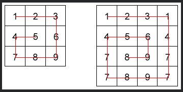

# [6kyu] Evil Autocorrect Prank

### Description

#### Snail Sort

Given an n x n array, return the array elements arranged from outermost elements to the middle element, traveling clockwise.

```
array = [[1,2,3],
         [4,5,6],
         [7,8,9]]
snail(array) #=> [1,2,3,6,9,8,7,4,5]
```
For better understanding, please follow the numbers of the next array consecutively:

```
array = [[1,2,3],
         [8,9,4],
         [7,6,5]]
snail(array) #=> [1,2,3,4,5,6,7,8,9]
```



This image will illustrate things more clearly:

NOTE: The idea is not sort the elements from the lowest value to the highest; the idea is to traverse the 2-d array in a clockwise snailshell pattern.

NOTE 2: The 0x0 (empty matrix) is represented as [[]]


### My Solution

```javascript
const snail = function(array) {
  let direction = 'right';
  const ret = [];

  const printItem = () => {
    switch(direction) {
      case 'right': {
        direction = 'down';
        array.shift().forEach(item => {
          ret.push(item);
        });
        break;
      }
      case 'down': {
        direction = 'left';
        array.forEach(item => {
          ret.push(item.pop());
        });
        break;
      }
      case 'left': {
        direction = 'up';
        const arr = array.pop();
        while(arr.length) {
          ret.push(arr.pop());
        }
        break;
      }
      case 'up': {
        direction = 'right';
        for(let i=array.length-1; i>=0; i--) {
          ret.push(array[i].shift());
        }
        break;
      }
    }
    return (0 === array.length)? ret: printItem();
  };
  return printItem(direction);
};
```

### Others Solutions

```javascript
snail = function(array) {
  var result;
  while (array.length) {
    // Steal the first row.
    result = (result ? result.concat(array.shift()) : array.shift());
    // Steal the right items.
    for (var i = 0; i < array.length; i++)
      result.push(array[i].pop());
    // Steal the bottom row.
    result = result.concat((array.pop() || []).reverse());
    // Steal the left items.
    for (var i = array.length - 1; i >= 0; i--)
      result.push(array[i].shift());
  }
  return result;
}
```

```javascript
snail = function(array) {
  var res = [];
  while(array.length) {
    res = res.concat(array.shift())
    array = expand(array);
  }
  return res;
}


function expand(matrix){
    return matrix.reduce(function(res, arr, i){
        arr.forEach(function(n, j){
            if (!res[j]) res[j] = [];
            res[j][i] = n;
        })
        return res;
    }, []).reverse();
}
```
