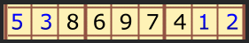
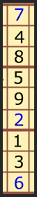
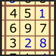
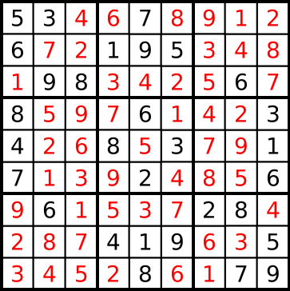

# [5kyu] Did I finish my sudoku

### Description

Write a function done_or_not passing a board (list[list_lines]) as parameter. If the board is valid return 'Finished!', otherwise return 'Try again!'

Sudoku rules:

Complete the Sudoku puzzle so that each and every row, column, and region contains the numbers one through nine only once.

Rows:



There are 9 rows in a traditional Sudoku puzzle. Every row must contain the numbers 1, 2, 3, 4, 5, 6, 7, 8, and 9. There may not be any duplicate numbers in any row. In other words, there can not be any rows that are identical.

In the illustration the numbers 5, 3, 1, and 2 are the "givens". They can not be changed. The remaining numbers in black are the numbers that you fill in to complete the row.

Columns:



There are 9 columns in a traditional Sudoku puzzle. Like the Sudoku rule for rows, every column must also contain the numbers 1, 2, 3, 4, 5, 6, 7, 8, and 9. Again, there may not be any duplicate numbers in any column. Each column will be unique as a result.

In the illustration the numbers 7, 2, and 6 are the "givens". They can not be changed. You fill in the remaining numbers as shown in black to complete the column.

Regions



A region is a 3x3 box like the one shown to the left. There are 9 regions in a traditional Sudoku puzzle.

Like the Sudoku requirements for rows and columns, every region must also contain the numbers 1, 2, 3, 4, 5, 6, 7, 8, and 9. Duplicate numbers are not permitted in any region. Each region will differ from the other regions.

In the illustration the numbers 1, 2, and 8 are the "givens". They can not be changed. Fill in the remaining numbers as shown in black to complete the region.

Valid board example:



For those who don't know the game, here are some information about rules and how to play Sudoku: http://en.wikipedia.org/wiki/Sudoku and http://www.sudokuessentials.com/
### My Solution

```javascript
function doneOrNot(board){
  let value;
  // check row
  board.forEach(rows => { return (value = check(Object.assign([], rows))); });
  if(value) {
    // check column
    for(let i=0; i<board.length; i++) {
      let column = [];
      for(let j=0; j<board.length; j++) {
        column[j] = board[j][i];
      }
      if(!check(column)) {
        return 'Try again!';
      }
    }
  } else {
    return 'Try again!';
  }
  // check region
  for(let cnt=0; cnt<9; cnt++) {
    const region = [];
    let idx = 0;
    for(let i=Math.floor(cnt/3)*3; i<(Math.floor(cnt/3)+1)*3; i++) {
      for(let j=(cnt%3)*3; j<((cnt%3)+1)*3; j++) {
        region[idx++] = board[i][j];
      }
    }
    if(!check(region)) {
      return 'Try again!';
    }
  }
  return 'Finished!';
}

function check(rows) {
  let value = 1;
  rows.sort().forEach(item => {
    return (item != value)? (value = 0): value++;
  });
  return value;
}
```

### Others Solutions

```javascript
function doneOrNot(rows){

  var columns = []
  ,    blocks = [];

  for (var i = 0; i < 9; i++) {
    columns[i] = [];

    for (var j = 0; j < 9; j++) {
      var k = Math.floor(i / 3) + Math.floor(j / 3) * 3;
      blocks[k] = blocks[k] || [];

      blocks[k].push(rows[i][j]);
      columns[i].push(rows[j][i]);
    }
  }

  var is_valid_row = (row) => row.slice(0).sort((a, b) => a - b).join('') == '123456789';

  var is_valid = rows.every(is_valid_row)
    && columns.every(is_valid_row)
    && blocks.every(is_valid_row);

  return is_valid ? 'Finished!' : 'Try again!';
}
```

```javascript
function doneOrNot(board){
  var set1Array = new Set(),
      set2Array = new Set(),
      set3Array = new Set();

  for (var i = 0; i < 9; i++) {
    for (var j = 0; j < 9; j++){
      set1Array.add(board[i][j]);
      set2Array.add(board[j][i]);
      set3Array.add(board[(i%3)*3+j%3][Math.floor(i/3)*3+Math.floor(j/3)]);
    }
    if (set1Array.size != 9 || set2Array.size != 9 || set3Array.size != 9 )
      return "Try again!";
    set1Array.clear();
    set2Array.clear();
    set3Array.clear();
  }
  return "Finished!";
}
```
