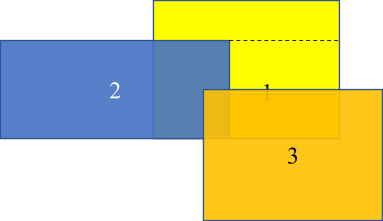

# 새로운 광고상품

배달의민족은 시범적으로 새로운 광고 상품을 만들기로 하였습니다. 시범 서비스이기 때문에, 일부분의 지역에서 3개의 업소를 대상으로만 진행해 볼 생각입니다.


각 업소는 직사각형 모양의 광고 영역을 설정하고, 단위 영역 당 지불할 광고비를 책정하여 배달의민족에 제출합니다. 특정 지역은 2개 이상의 업소의 광고 영역에 포함될 수 있는데, 이 때는 가장 높은 광고비를 책정한 업소의 광고만 노출 됩니다. 광고비 정산은, 업소가 정한 단위 영역 당 광고비와 광고 노출 영역의 곱으로 이루어지기 때문에 각 업소의 광고 상품이 노출되는 면적을 알아내는 것이 필요합니다.


3개 업소에서 단위 영역 당 지불하는 광고비의 오름차순으로 업소 번호를 부여했을 때, 1번 업소가 노출되는 영역의 면적은 얼마인지 구하는 프로그램을 작성하십시오.




위에서 각 직사각형의 좌표가 다음과 같다고 하면

* 1번 직사각형의 왼쪽 아래 좌표가 (700, 400), 오른쪽 위 좌표가 (1600, 1100)
* 2번 직사각형의 왼쪽 아래 좌표가 (0, 400), 오른쪽 위 좌표가 (1100, 900)
* 3번 직사각형의 왼쪽 아래 좌표가 (900, 0), 오른쪽 위 좌표가 (1800, 650)


1번 직사각형과 2번 또는 3번이 겹치는 영역에서는 2번과 3번이 단위 영역 당 광고비를 더 많이 지불했음으로 1번 업소의 광고가 노출이 안 되게 됩니다. 위 그림에서 1번 업소가 노출되는 영역의 면적은, 점선 위 영역과(900 * 200 = 180,000) 점선 아래 영역을(500 * 250 = 125,000)을 합한 305,000이 됩니다.


광고비 정산은, 업소가 정한 단위 영역 당 광고비와 광고 노출 영역의 곱으로 이루어지기 때문에 각 업소의 광고 상품이 노출되는 면적을 알아내는 것이 필요합니다.


입력은 한 줄에 다음과 같이 12개의 정수가 공백으로 구분되어 주어집니다.

x1  y1  x2  y2  x3  y3  x4  y4  x5  y5  x6  y6

* 1번 업소 직사각형의 왼쪽 아래 꼭지점이 (x1,y1), 오른쪽 꼭지점이 (x2,y2)
* 2번 업소 직사각형의 왼쪽 아래 꼭지점이 (x3,y3), 오른쪽 꼭지점이 (x4,y4)
* 3번 업소 직사각형의 왼쪽 아래 꼭지점이 (x5,y5), 오른쪽 꼭지점이 (x6,y6)


각 꼭지점의 x, y 값은 모두 1이상 10,000 이하이며, 표준 입력으로 12개의 정수가 주어졌을 때 1번 업소의 노출 영역의 면적을 출력하는 프로그램을 작성하십시오.


## 입/출력 예시
#### 입력 1
```
700 400 1600 1100 0 400 1100 900 900 0 1800 650
```
#### 출력 1
```
305000
```